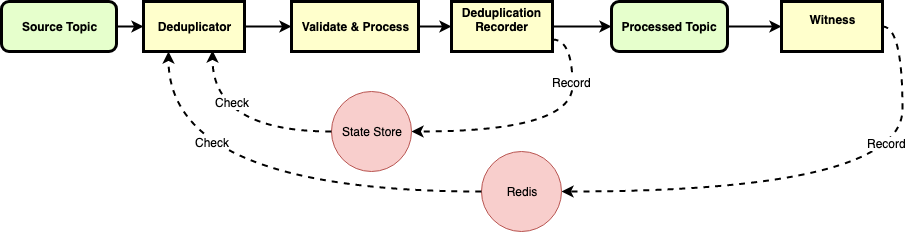

# Upgrading Kafka Streams from exactly-once delivery to exactly-once processing
A well-tuned, multi-broker Kafka cluster is resilient to hardware errors, generally stable and blazingly fast.  It also boasts of an “exactly-once” delivery mode, which does work as described, albeit in a very specific scenario.   

For these reasons, we have put Kafka at the heart of our technology stack when building our new bank, but banking software comes with a whole load of trust, ethical and regulatory issues that do not necessarily exist in other environments. If an analytics platform fails to record a page view, nobody will panic; if a dinner reservation goes missing, someone may be grumpy, but ultimately, they'll be OK.  If a bank loses a payment for a £300,000 house, or if it processes the payment twice (a much more likely scenario, as we’ll see), a lot of people are going to have a bad day. 

We take our responsibilities seriously at Zopa, and have put a lot of effort into modelling potential failure cases that Kafka out-of-the-box can’t protect against.  Despite Kafka’s exactly-once semantics, one of the most common types of failure is message-reprocessing.  Read on to find out about why it happens, why Kafka’s exactly-once semantics aren’t as wide as you’d hope, and some of the ways we at Zopa protect against it.

---
*Please take note that this article was written to raise awareness of some common failure cases, and reasonable mitigations.  It assumes a working knowledge of the Kafka Streams, Processor API (including state stores) and it is not an exhaustive list of failure modes, as there are too many to write about, so please use this as an illustrative resource* 

---

## Our sample Kafka Streams app 
For the purposes of demonstration, let’s assume a simple Kafka Streams topology, which accepts messages form a source topic, validates them, processes them, and finally sends them on to some feed topic, depending on whether the message was successfully processed.


We will use this simplified topology as our starting point, and build it up until it is fit for purpose.

## Failure mode 1 – loss of offsets 
Although Kafka Streams supports exactly-once semantics, this applies to messages in-flight, and works by coordinating the upstream producer and the broker on one side of the topology, and coordinating the topology’s producer & offset recorder with broker at the rear end.  This is great for handling application crashes or network glitches, but a common occurrence with Kafka is offset loss.  This could happen due to a technical error, or simply by not receiving a message in the last 7 days, but it is a relatively common Kafka failure mode.

---
*Remember that it may not be your system that loses an offset; if an upstream topology loses its offsets, it may well start resending you messages you have already processed.*

---

To protect against offset loss, we can add a deduplicator processor to filter out messages we have already processed.  Our first attempt doesn’t need to be complex – choose a deduplication key for each message.  It should be unique for a specific massage, e.g. in our case, a combination of transaction id and transaction type could suffice, so long as our upstream message sources are aware of the policy (it’s a lot more complicated than this in real life, as always). 

 

We can implement the deduplicator using a Kafka Streams [windowed state store](https://docs.confluent.io/current/streams/developer-guide/processor-api.html#defining-and-creating-a-state-store).  Remember, when choosing the window duration, you need to balance protection offered vs node rebalancing time in the event of a new instance coming online; if you need to rehydrate 10bn records into a state store, your entire application will stop processing for quite a while, even nodes that have been happily processing whilst the application rebalances

---
*These code samples shouldn’t be copied; they are the absolute minimum skeleton needed to explain the idea.  They lack logging, metrics, structure and subtlety required of production software*

---

```java
public class DeduplicatorProcessor extends AbstractProcessor<String, Transaction> { 
 
  WindowStore<String, Long> deduplicationStore;

  @Override 
  public void init(final ProcessorContext context) { 
    super.init(context); 
    deduplicationStore = (WindowStore<String, Long>) context.getStateStore("deduplication-store"); 
  } 
 
  @Override 
  public void process(final String key, final Transaction value) {

  Long now = clock.now();
  String deduplicationId = getDeduplicationId(value); 
  try (WindowStoreIterator<Long> timeIterator = deduplicationStore.fetch(deduplicationId, windowStart, now)) { 
    if(timeIterator.hasNext()) { // we have seen this is, so we are processing a duplicate 
      context.forward(key, createRejectionFrom(value), To.child("duplicate-feed")); 
      } else { 
        deduplicationStore.put(key, now, now); 
        context.forward(key, value, To.child("validator")); 
      } 
    } 
  } 
} 
```

Now we have a topology which looks like this.  We choose to have a separate rejection topic for duplicates since they are indicative of a kafka-level malfunction


### Some subtlety 
Great, we can make use of EOS to ensure that a message is processed exactly once, with the duplication protecting us from offset loss, but there is a major logical flaw here – imagine we have a bug in our validator, and we reject a legitimate message.  If we fix the bug and tell the upstream team to resubmit the message we accidentally rejected, that message would now be deduplicated.  We need to record the message after we are sure processing will be successful.  Without going down to code level, we need to check for, and reject duplicates at the beginning of the topology, and record deduplication Ids at the end of the happy path.


### Almost There
This general pattern has served us well for simple deduplication / offset-loss protection.  But we have one more consideration: if you choose a deduplication windows of 24 hours, process a message and then receive a duplicate 48 hours (or 1 year, or 5 years) later, your state store won’t cut it.  This case is solved by rejecting messages older than your deduplication window right in the deduplicator.

 
 
 ## Failure mode 2 – Loss of deduplication topics 
 Sometimes, things go horribly wrong, which may lead to the loss of a topic.  It could be an unfortunate terraform config, a Kafka bug, or even malice, but ultimately, if your application’s correctness is important enough, you need to protect against it.  In this example, we are going to protect against one of the simpler problems – loss of the deduplication store’s changelog topic.  When our streams node starts, the first thing it will do is rehydrate its RocksDB online state store from the changelog.  If we can’t, our current deduplication strategy is dead in the water.  At this point, we need to diversify from the Kafka ecosystem to spread our risk.  Let’s take a slightly different look at our happy path, with just the salient stages
 


At Zopa, we protect against losing our changelog (or RocksDB) by using Redis as an additional repository of deduplication data.  Now, losing any single deduplication store allows us to continue process messages whilst maintaining our deduplication guarantees, but we use a different recording strategy for Redis vs the state store, as explained below. 



This is starting to look a little fruity, so I think it’s important to answer 2 important questions: 

1. If we use Redis, why bother with the RocksDB-based state store at all? 
2. Why do we record to Redis at a different point to the State Store? 

The answers to these questions revolve around the fact that the two stores fulfil complementary, but different requirements.  RocksDB provides instantaneous transactional deduplication; if 2 duplicate messages are processed within 1ns, RocksDB will provide adequate protection, with all of the caveats mentioned above.  We do not write to Redis inside of the main topology because if it were to become unavailable, we would have to decide to halt the topology, or wait indefinitely until it came back.  Neither of these are acceptable, so we use a “Witness” to record deduplication ids to Redis once messages have been processed.  Due to this asynchronous nature of the Redis recording-process, we cannot rely on it to deduplicate messages arriving in quick succession.

---
*A note on clearing deduplication ids from Redis*

*If you implement a Redis-bases deduplicator, do not be tempted to set a key expiration date when adding keys.  Redis deletes keys with TTLs by randomly sampling 20 keys in a set every 100ms, deleting any that have expired.  If more than 25% are expired, it will run another sweep.  [Check here](https://redis.io/commands/expire#how-redis-expires-keys) for more info. Importantly, this process is non-deterministic, and may not be able to cope with the volume of new keys being introduced into the system.  I recommend double-writing into rotating, overlapping sets, and deterministically removing those periodically.* 

---

## Rounding up
Kafka Streams comes with may useful features out of the box, but where exactly-once processing at a business level is important, they are really only building blocks.  This blog post has covered some major components of a “hopefully, pretty much once” processing scheme, but there are more aspects to consider to end up with a truly safe system.  Ultimately, it relies on a huge modelling effort of your specific topology and domain, to come up with a list of failure modes, and their respective likelihood and importance.  I hope this article has opened your eyes to some of the complexity of building reliable distributed systems, and show you that distributed failures need to be treated with respect, because dealing with these issues at 3am would not be much fun at all 
